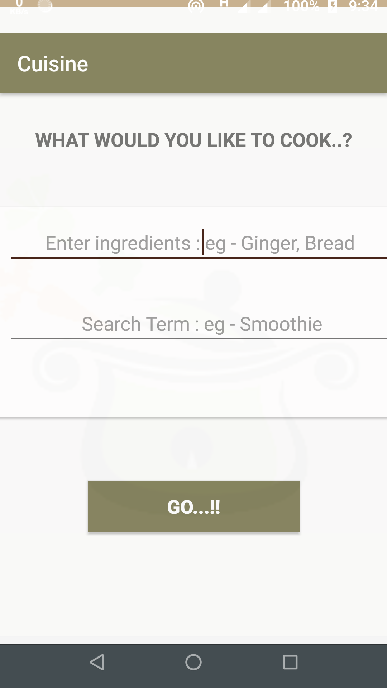
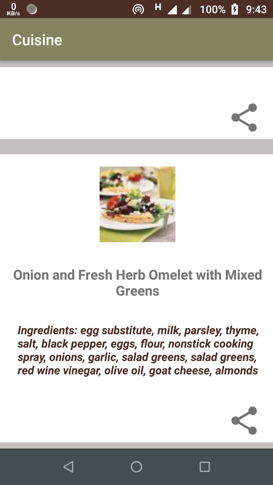
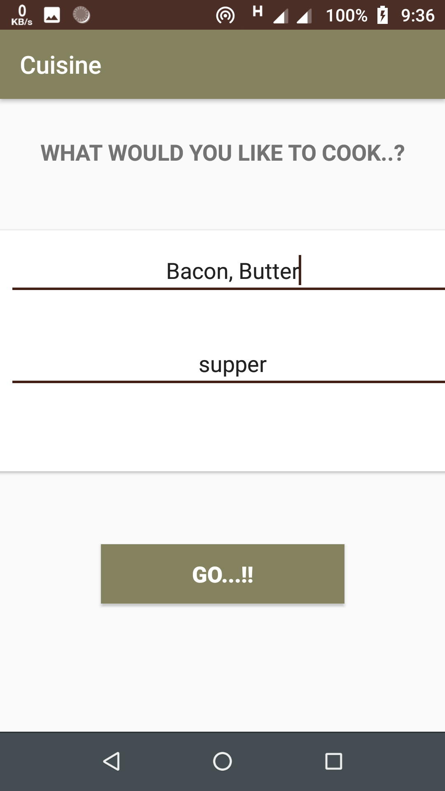
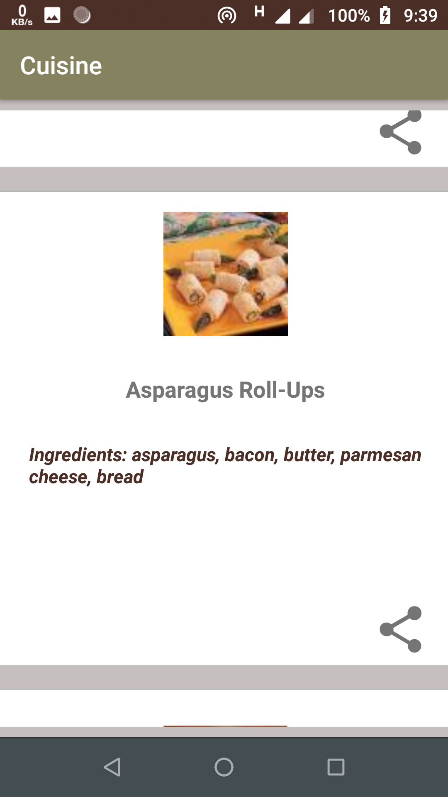
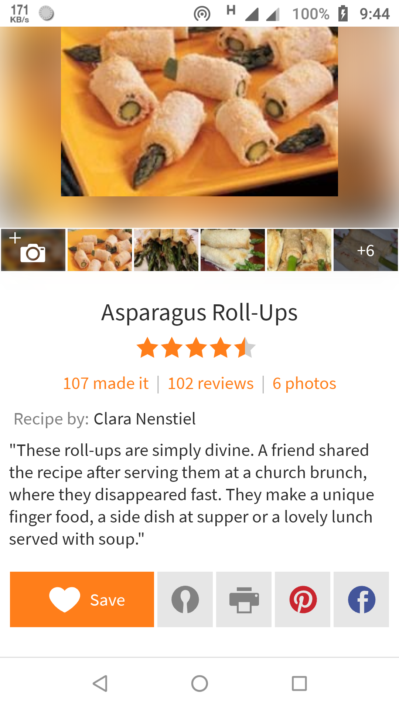
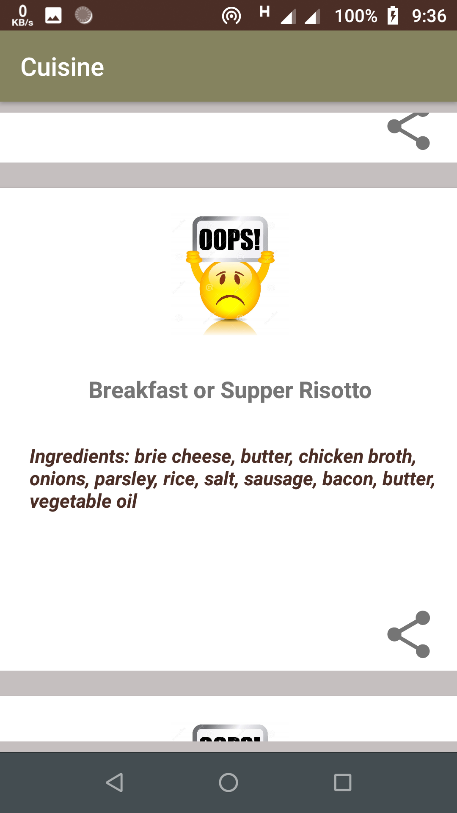
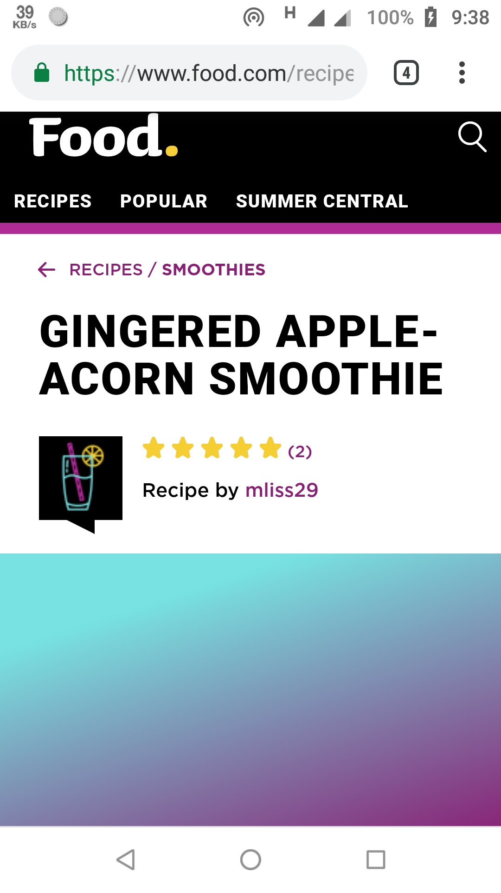

#  Cuisine

## Overview

For all the maniacs of cooking and those who have a hidden chef, the Cuisine app provides the recipe for the dish you want to cook with your own ingredients..!!
sounds amazing..??
It uses `Google volley library` alongwith `picasso` to bring out the image for a dish, also uses `json` for fetching the data 
concept of `remote api` is implemented
Also it `redirects to browser` for the details of a particular recipe.

## Features

* Google's Volley Library
* Remote API
* Picasso Libray
* Recipe Puppy API
* Splash screen
* Animation styles
* Custom ListView
* Cardview
* Customized buttons
* Webview
* ImageView
* Minimal Design
* Simplified Theme
* Well Constrained Layout

## Platform
        -> Android Studio
        -> With Kotlin Support

## Accessing tips :

1. Clone or download the repository: `https://github.com/P4NK4J/android_kotlin_Cuisine_app`
2. Navigate to the folder `app` Folder
3. Navigate to the folder `anroid_kotlin_Cuisine_app/app/src/` to access developers content
3. Navigate to the folder `Apk` for users to access apk
4. Copy the apk from folder `Apk` to an android phone
5. Install the apk

The app is finally installed on your Android mobile device !!

To directly download the apk [Click Here](https://github.com/P4NK4J/android_kotlin_Cuisine_app/blob/master/APK/cuisine.apk)

 # Screenshots:

 
 

 
 

## Resources, Activities and Manifest for the Application

For curious Kotlin programmers [Click here](https://github.com/P4NK4J/android_kotlin_Cuisine_app/tree/master/app/src/main/java/com/example/cuisine/activity)

Packages for backend Files:

* [activity](https://github.com/P4NK4J/android_kotlin_Cuisine_app/tree/master/app/src/main/java/com/example/cuisine/activity/activity)
* [data](https://github.com/P4NK4J/android_kotlin_Cuisine_app/tree/master/app/src/main/java/com/example/cuisine/activity/data)
* [model](https://github.com/P4NK4J/android_kotlin_Cuisine_app/tree/master/app/src/main/java/com/example/cuisine/activity/model)

Frontend resource files are stored in `res` package

* [res](https://github.com/P4NK4J/android_kotlin_Cuisine_app/tree/master/app/src/main/res)

Android manifest file for the project:

* [AndroidManifest.xml](https://github.com/P4NK4J/android_kotlin_Cuisine_app/blob/master/app/src/main/AndroidManifest.xml)
